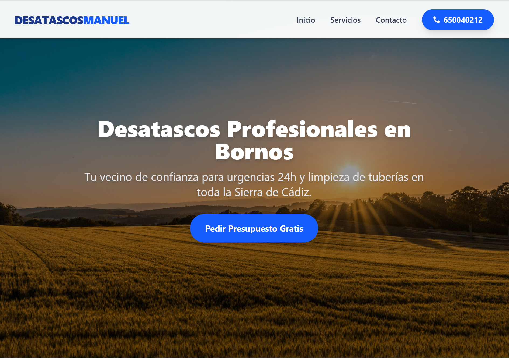

[Leer en Español](#-desatascos-manuel---web-corporativa) | [Read in English](#-desatascos-manuel---corporate-website)
# 🚛 Desatascos Manuel - Web Corporativa

> **Solución web profesional para servicios de urgencias 24h y mantenimiento en la Sierra de Cádiz.**


## 📋 Sobre el Proyecto

Este proyecto es una **Single Page Application (SPA)** desarrollada para digitalizar un negocio local de desatascos y fontanería. 

El objetivo principal era crear una presencia digital rápida, accesible y enfocada en la conversión (llamadas de urgencia), sustituyendo métodos tradicionales por una solución tecnológica moderna.

### 🚀 Despliegue (Demo)
Puedes ver el proyecto en funcionamiento aquí:
👉 **[https://web-jose-manuel-seven.vercel.app/]**

---

## 🛠️ Stack Tecnológico

He utilizado un stack moderno enfocado en el rendimiento (Performance) y la experiencia de usuario (UX):

<p align="left">
  
  
  
  
  
</p>

---

## ✨ Características Principales

* **⚡ Rendimiento Ultra-rápido:** Construido con **Vite**, eliminando tiempos de carga innecesarios críticos para servicios de urgencia.
* **📱 Diseño Mobile-First:** Interfaz totalmente responsiva y adaptada a móviles (donde ocurren el 90% de las búsquedas de urgencias).
* **📧 Gestión de Presupuestos:** Integración con **EmailJS** para recepción de formularios de contacto directamente al correo del cliente sin necesidad de Backend complejo.
* **🎨 UI/UX Moderna:** Uso de **Tailwind CSS** para un diseño limpio, con feedback visual (Toasts/Confetti) para mejorar la interacción del usuario.
* **🔒 Seguridad y Optimización:** Código limpio y estructurado siguiendo buenas prácticas de componentes en React.

---

## 📸 Capturas de Pantalla



---

## 🔧 Instalación Local

Si deseas clonar y ejecutar este proyecto en tu entorno local:

```bash
# 1. Clonar el repositorio
git clone https://github.com/recamalesdev/web-jose-manuel.git https://github.com/recamalesdev/web-jose-manuel.git

# 2. Entrar en el directorio
cd web-jose-manuel

# 3. Instalar dependencias
npm install

# 4. Iniciar servidor de desarrollo
npm run dev
```

👤 Autor
Bernardo Recamales

Desarrollador Frontend & Trail Runner 🏔️

---

#-desatascos-manuel---corporate-website
*(Translated with the assistance of AI for technical accuracy)*

> **Professional web solution for 24/7 emergency services in Sierra de Cádiz, Spain.**

This is a **Single Page Application (SPA)** developed to digitize a local business. 

### 🚀 Demo & Code
- **Live Site:** [https://web-jose-manuel-seven.vercel.app/]
- **Stack:** React, Vite, Tailwind CSS, EmailJS.

---

